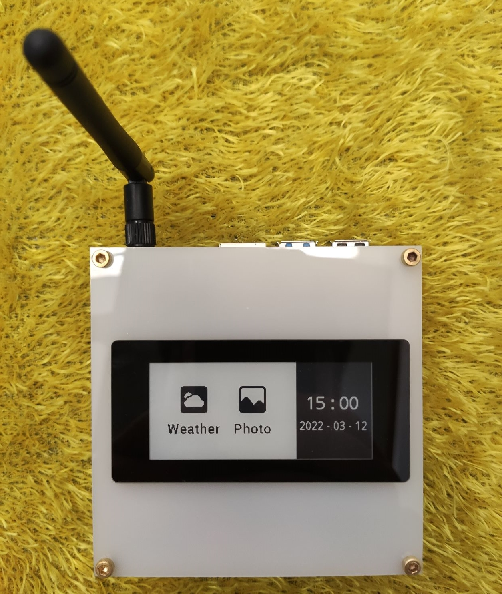
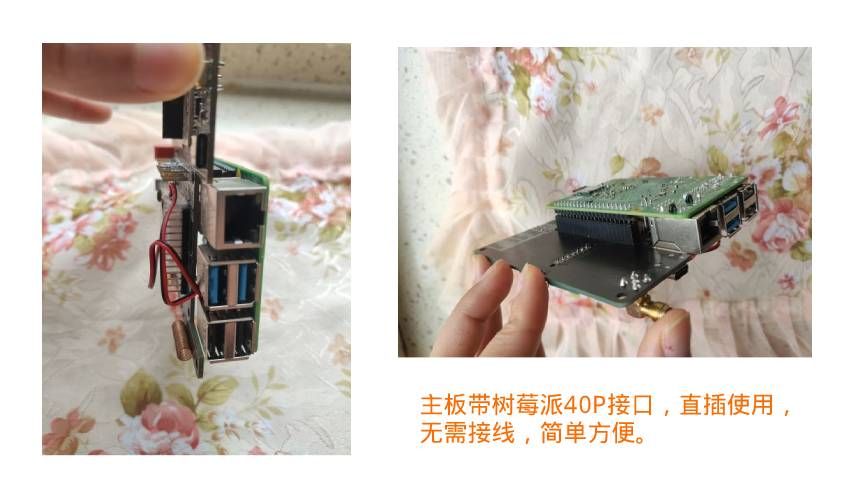

# 前言
感谢各位使用HERlON品牌的全功能网关

## 开发初衷
从2015年开始玩[homeassistant](https://www.home-assistant.io/),就爱上这个智能家居平台，然后就绞尽脑汁的想将手头上的米家设备都集成到hass里面去，最初使用的米家自家的zigbee网关，但是这个网关三天两头的闹情绪，隔一段时间必然就会所有子设备全部掉线，必须要重启网关，一气之下，就萌生了自己开发zigbee网关的念头，在2017年立项，从最初功能比较单一的黑色外壳的网关，到今天的全功能超级网关，中间迭代了无数个版本，积淀了大量的相关技术和经验，也感谢这么多年来hass圈子里面的小伙伴们给提供的很多技术支持。

## 目的

:::tip
研发本网关最基本的也是最核心的宗旨就是将您手里的绝大部分各种不同品牌的zigbee子设备全部统一接入到hass或者nodered
:::

## 网关可实现的功能

:smile: **wifi网关**
:smile: **zigbee网关**
:smile: **红外遥控中心**
:smile: **433射频遥控中心**
:smile: **4G联网**
:smile: **树莓派集成**
:smile: **高精度光线传感器**
:smile: **墨水屏集成**

## 网关特色
:::info
* 带esp32芯片，可实现网络管理，芯片全部采用**16M**闪存。
* zigbee芯片全部采用目前最高端的**CC2652P**的方案，芯片为美国德州仪器出品，自带AP功放，不管是负载子设备数量还是信号范围，都是目前首屈一指的。
* 带可接树莓派的排母接口，可直插树莓派，集成了树莓派，就无需在其他上位机部署z2m、hass等，实现真正意义的**allinone网关**，如果您正在使用树莓派，这应该是 最好的方案。
* 带多款2.9寸墨水屏接口，可直接接入目前市面上最常用的微雪和大连佳显等2.9寸墨水屏。
* 带4G模块接口，直插4G模块，就可通过4G网络联网，完美适应没有wifi的工业环境。
* 带红外和433射频功能，可实现遥控接收和遥控发射。
* 成熟的网络管理界面，可以实现在线刷入esp32和zigbee芯片的固件，方便快捷。
* 带BH1750高精度光线传感器，可实时检测室内光线强度，实现自动化联动。
* RGB氛围灯等其他功能，不再详细罗列。
:::

[*网关淘宝链接*][taobao]

[taobao]:https://item.taobao.com/item.htm?id=629986999102