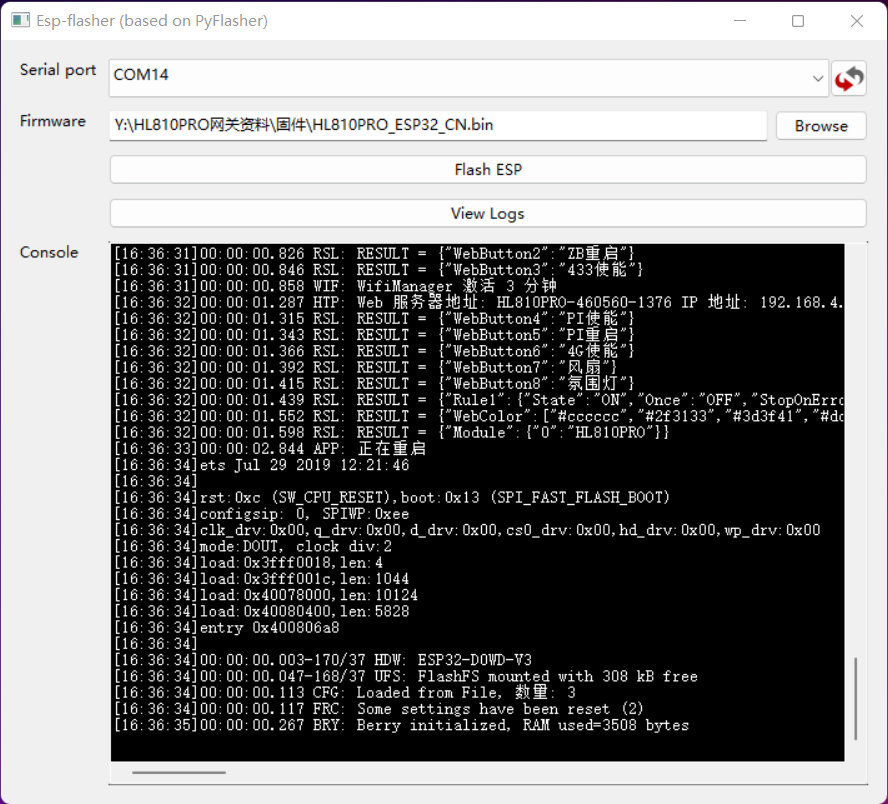
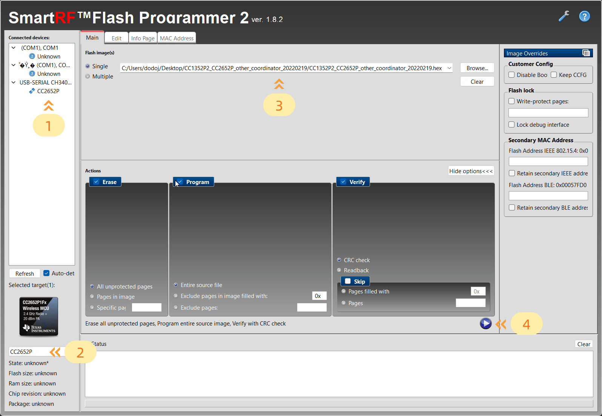

# 固件更新

:::caution 注意

1. ESP32不管选择哪种固件更新方式，均会重置到出厂状态，无法保留配置，请谨慎操作。
2. 如果您的网关连接到PC上没反应，那么您应该检查您的type-c数据线，目前市面有大量的type-c线只具备充电功能，无法传输数据。
3. ESP32烧录固件工具需要从国外网站下载必要的数据，如果您烧录失败，请搭建梯子之后再做尝试。

:::

## EPS32固件更新

### 使用界面OTA更新

1. 进入网关后台管理主界面，依次点击，`固件升级`-->`开始升级`，等待升级完成，这期间会有一段时间无法访问，不要着急，等待即可。
2. 进入网关后台管理主界面，依次点击，`设置`-->`重置配置`，在页面顶部弹出的提示框，点击`确定` ,这一步是必须要做的，否则新固件的更新项将无法生效。

:::tip

OTA链接：https://raw.githubusercontent.com/dodojie/HL810PRO/main/firmware/ESP32/HL810PRO_ESP32_CN.bin

:::

### 使用工具更新

1. 准备一台PC主机，win系统或mac系统均可。
2. [从此链接下载固件、驱动以及烧录工具](https://github.com/dodojie/HL810PRO),并务必先安装好CH340驱动。
3. 将网关拨动开关拨动开关按下表设置: 

> 1|ON
:---:|:---:
2|ON

4. 将网关用带数据传输功能的type-c数据线连接到已安装好驱动的主机上，打开[烧录工具](https://raw.githubusercontent.com/dodojie/HL810PRO/main/tutorial/data/ESP-Flasher-Windows-x64.exe)，选择网关的串口号，选择[固件文件](https://raw.githubusercontent.com/dodojie/HL810PRO/main/firmware/ESP32/HL810PRO_ESP32_CN.bin)，点击`Flash ESP` ，等待烧录成功，出现下图画面代表烧录成功。

   

## CC2652P固件更新

1. 准备一台PC主机，仅WIN系统可用。
2. [从此链接下载固件、驱动以及CC2652P专用烧录工具](https://github.com/dodojie/HL810PRO),并务必先安装好CH340驱动。
3. 将网关拨动开关拨动开关按下表设置：

> 1|OFF
:---:|:---:
2|OFF

4. 先打开[CC2652P专用烧录工具](https://jihulab.com/dodojie/hl810pro/-/raw/main/flash-programmer-2-1.8.2.zip)
5. 按住网关主板上的BOOT按钮，不要松开，然后将网关用type-c数据线连接到PC上，此时，可松开按钮。
6. 在烧录工具的界面左侧，串口选择列表中，选中`USB-SERIAL CH340K(COM x)`下方的`Unknown`，然后在下方的`Select Target Device`下拉选择框中，选择`CC2652P`
7. 在烧录工具的界面上方，选择好要烧录的[固件文件](https://raw.githubusercontent.com/dodojie/HL810PRO/main/firmware/CC2652P/CC1352P2_CC2652P_other_coordinator_20220219.hex)。其他地方均不要修改。
8. 点击右下方的圆形内部带三角的按钮，等待烧录成功。

:::caution 注意

固件文件的路径一定不能带中文，否则，烧录工具会报错，烧录失败。

:::

如下图所示：

