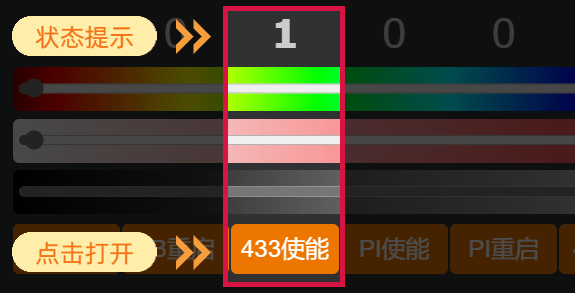

# 433射频


## 433接收

### 打开使能

在网关后台管理主页面，点击`433使能`，打开433射频接收功能，此处开关仅影响接收功能，不控制433发射功能。

如图所示：



### 接收遥控码

1. 网关后台管理主页面 ---> `Consoles`  --->  `控制台`，在此页面准备好。
2. 按下433遥控器的任意按键，如果该433射频码能够正确解析的话，刚才打开的控制台页面将会打印出类似以下格式的遥控码，如果多次按下按键均没有出现以下内容，请尝试刷新控制台页面或者检查使能开关是否已开启。

```
... {"Time":"2022-09-17T12:05:53","RfReceived":{"Data":"0x8D4961","Bits":24,"Protocol":1,"Pulse":360}}
```

3. 将`{"Data":"0x8D4961","Bits":24,"Protocol":1,"Pulse":360}`部分复制下来，为后面的433发射而使用。


## 433发射

1. 网关后台管理主页面 ---> `Consoles`  --->  `控制台`。

2. 在控制台发送如下命令即可发送该按键的遥控码，RFsend后面的数据是您在433接收阶段获取的遥控码。
```
RFsend {"Data":"0x8D4961","Bits":24,"Protocol":1,"Pulse":360}
```


:::note 注意

1. 433射频接收和发送的有效距离有限，请将网关放在433设备足够近的地方使用。
2. 并不是所有的433遥控码都能正确解析。

:::


## mqtt相关主题与消息


### 433接收使能的开启与关闭


#### 控制主题
** <font color="#00dd00">MQTT主题</font><br /> **

```
cmnd/HL810PRO_[网关MAC后六位]/POWER3
```

后面的所有主题均以`HL810PRO_46AC70`为例

** <font color="#00dd00">MQTT消息内容</font><br /> **

`ON` 打开433接收使能

`OFF` 关闭433接收使能

#### 反馈主题

** <font color="#00dd00">MQTT主题</font><br /> **
```
stat/HL810PRO_46AC70/RESULT
```
** <font color="#00dd00">MQTT消息内容</font><br /> **
`{"POWER3":"ON"}`或者`{"POWER3":"OFF"}`


### 433接收

当您已开启433接收使能，并且在有效范围内按下了433遥控器按键，那么您将在以下mqtt主题中获取到遥控码。

** <font color="#00dd00">MQTT主题</font><br /> **
```
tele/HL810PRO_46AC70/RESULT
```
** <font color="#00dd00">MQTT消息内容</font><br /> **

```
{"Time":"2022-09-17T15:17:43","RfReceived":{"Data":"0x8D4961","Bits":24,"Protocol":1,"Pulse":361}}
```

将消息内容中的`{"Data":"0x8D4961","Bits":24,"Protocol":1,"Pulse":361}`部分复制下来用于433发送。


### 433发射

#### 控制主题

** <font color="#00dd00">MQTT主题</font><br /> **
```
cmnd/HL810PRO_46AC70/RFsend
```
** <font color="#00dd00">MQTT消息内容</font><br /> **
```
{"Data":"0x8D4961","Bits":24,"Protocol":1,"Pulse":360}
```
该消息内容是您在433接收阶段获取并复制下来的遥控码。
#### 反馈主题

** <font color="#00dd00">MQTT主题</font><br /> **
```
stat/HL810PRO_46AC70/RESULT
```

** <font color="#00dd00">MQTT消息内容</font><br /> **
```
{"RfSend":"Done"}
```
该反馈主题和消息仅能反馈控制命令的发送成功与否，不能反馈控制命令的执行结果。


