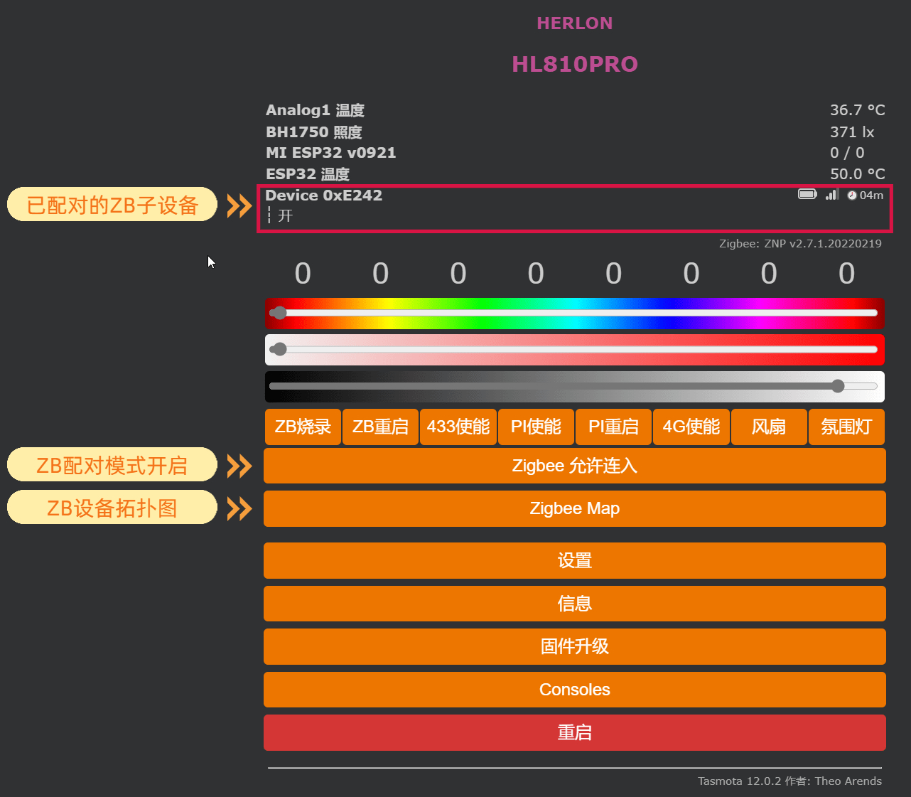

# SA模式

## 拨动开关

拨动开关切换到如下状态。

1|ON
:---:|:---:
2|OFF
:::caution 注意

进行下一步之前，请务必确认拨动开关是否已设置正确，否则zigbee功能在此模式下将不能正常工作。

:::

## 设置

1. 进入网关管理页面，依次进入，`设置`-->`模板设置`
2. 设置引脚如下   
   `GPIO1 --->  Zigbee Tx`  
   `GPIO3 --->  Zigbee Rx`

如图所示:  

## 配对

1. 在后台管理主页面，点击  `Zigbee 允许连入` 等待。
2. 操作zigbee子设备，使其进入配对模式，

:::tip

**用小米无线开关举例：**   
用卡针插进无线开关背面较大那个孔内，按住不松手，等待背面小孔里面的蓝色led闪烁几次，然后松开，观察网关后台管理页面的提示，等待配对完成即可。

:::

## 测试

此时操作刚才配对的子设备，在网关管理主页面会看到相应变化，进入`Consoles`-->`控制台`，会看到更为详细的触发状态变化。