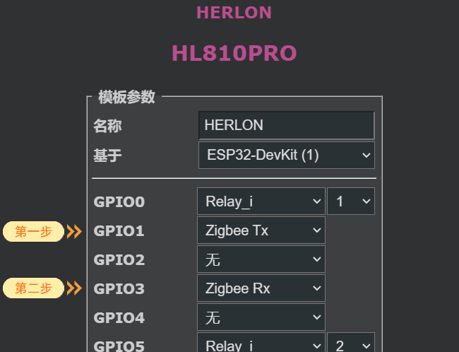

# 开启SA模式

## 拨动开关

拨动开关切换到如下状态。

1|ON
:---:|:---:
2|OFF
:::caution 注意

进行下一步之前，请务必确认拨动开关是否已设置正确，否则zigbee功能在此模式下将不能正常工作。

:::

## 设置

1. 进入网关管理页面，依次进入，`设置`-->`模板设置`
2. 设置引脚如下   
   `GPIO1 --->  Zigbee Tx`  
   `GPIO3 --->  Zigbee Rx`

如图所示:  

