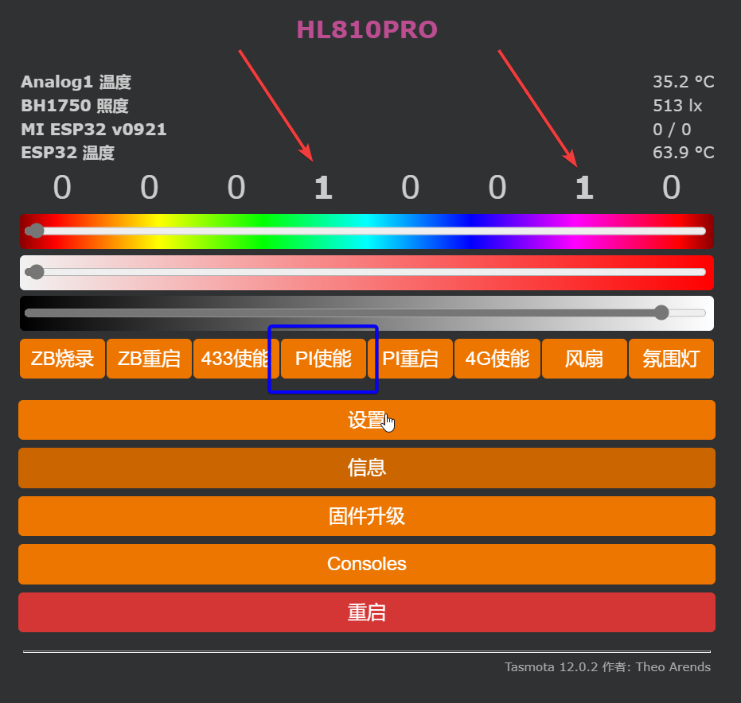

# 树莓派


## 拨动开关

拨动开关切换到如下状态。

1|ON
:---:|:---:
2|ON
:::caution 注意

进行下一步之前，请务必确认拨动开关是否已设置正确，否则zigbee功能在此模式下将不能正常工作。

:::

## 开启树莓派使能

在操作之前，请先在网关的web管理页面，开启树莓派使能，否则树莓派将不工作。正常情况下，您开启树莓派使能的时候，风扇将同时开启，如果风扇未开启，请尽快查找问题。

:::danger

请勿在散热风扇不转的情况下长时间使用树莓派，否则可能会导致树莓派因过热而损毁

:::

如下图所示：




## 调整树莓派串口

> 使用以下教程之前请先将树莓派系统更新到最新版本


1. 关闭console

```
sudo nano /boot/cmdline.txt
```

删除 ` console=serial0,115200, `部分，其余保持不变

ctrl+X ---> 输入y ---> 回车，完成保存。

2. 禁用蓝牙
```
sudo nano /boot/config.txt
```

在末尾添加上 `dtoverlay=disable-bt` 

ctrl+X ---> 输入y ---> 回车，完成保存。

```
sudo systemctl disable hciuart
```
重启使其生效
```
sudo reboot
```

3. 确认调整串口是否成功。

执行以下命令
```
ls -l /dev/serial*
```

如果返回以下类似内容，那么表示您前面已设置正确。
```
lrwxrwxrwx 1 root root 7 Aug 31 16:17 /dev/serial0 -> ttyAMA0
lrwxrwxrwx 1 root root 5 Aug 31 16:17 /dev/serial1 -> ttyS0
```

如果返回`/dev/serial1 -> ttyAMA0` 表示您前面的设置不正确，请回头重新检查所有步骤。


## 上位机配置

import Tabs from '@theme/Tabs';
import TabItem from '@theme/TabItem';

<Tabs>
  <TabItem value="Z2M" label="Z2M" default>

打开z2m的配置文件 `configuration.yaml` ,修改以下配置：

```
# 开启ha自动发现
homeassistant: true

# 开启配对模式
permit_join: true

# 开启前端网页管理(默认端口号为8080)
frontend: true

# MQTT配置
mqtt:
  # mqtt发布主题前缀
  base_topic: zigbee2mqtt
  # mqtt服务器地址(请务必改成自己的服务器地址)
  server: 'mqtt://192.168.100.1:1883'
  # mqtt账号密码，如果有账号密码请去掉前面的注释，如果没有无需修改。
  # user: my_user
  # password: my_password

# 串口设置(务必跟此处配置一致，请勿修改)
serial:
  port: /dev/ttyAMA0
```
  </TabItem>
  <TabItem value="ZHA" label="ZHA">

homeassistant搜索集成 `zha` 并添加 ---> 选择 `/dev/ttyAMA0`提交(如果没出现此串口地址，那么证明没有成功将串口引入到hass容器内，请检查您的设置)


  </TabItem>
</Tabs>


:::caution 注意
如果docker部署的zigbee2mqtt或者homeassistant，请在docker部署命令中加入`--device=/dev/ttyAMA0`参数，将串口引入到docker容器中，否则容器无法使用串口。
:::


